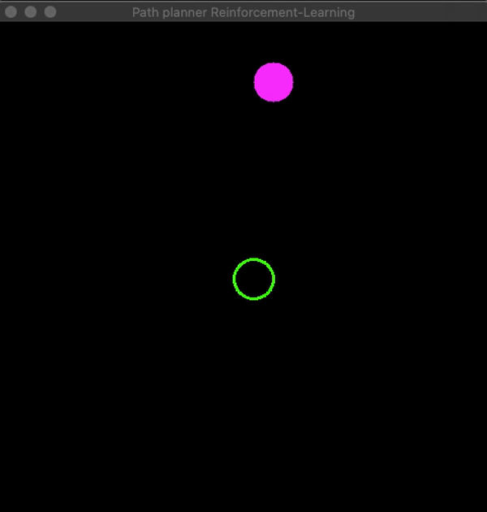

# Qlearning-cpp
A library implementing Q learning with modern C++ syntax and using Opencv for simulation



## Getting Started
To define a QLearning agent

Let's say you want to solve a path planning problem with the help of Reinforcement learning. You want to reach a goal coordinate of (x,y). You can train a Qlearning agent to reach this goal using the following code. Note: This program does not use pytorch. Future versions will include Deep Q networks that will use pytorch. 
```cpp
#include <iostream>
#include <vector>
#include "algorithms.hpp"
#include "logic.hpp"
#include "player.hpp"
int main(int argc, const char *argv[])
{
    // insert code here...

    // QLearning(int state size, int range of values state can take, int action size vector)
    QLearning q(2, 16, 4);
    q.SetEpsilon(0.8); //A function to set Epsilon
    q.GetEpsilon();    //Print Epsilon to the console
    //q.Show(); //To print the Q table to the console
    Player::_goal = {5, 5}; //Function to set the goal coordinates of the agent in {int x, int y}. Note: Goal should be within the statespace bounds

    Logic l;      //The brains behind implementation
    l.Run(q, 16); //16 is the same range as above in QLearning q;
}

```
The following defines a qlearning agent with 2 state variables (x,y), and a state space of length 16 i.e <br/>
-8<= x < 8 <br/>
-8 <= y < 8 <br/>

4 represents the number of actions that the agent can take. In this case action 0 corresponds to moving 1 unit in x direction, action 1 corresponds to moving -1 unit in x direction and so on.
```
QLearning q(2, 16, 4);
```

The *Player::_goal* static variable defines the goal coordinates of the agent.

```
Player::_goal = {5, 5};
```
The following function starts the learning. <br/>
Note : 16 is the length of the state space that should match the Qlearning's argument.
```
l.Run(q, 16);
```


## Contributing
This repository is in it's beginning stages. The goal of this project is to use the speed and efficiency of C++ along with its modern syntax to provide a simple interface for the user to test his/her algorithms. If you feel you are interested in contributing please send me an email as I am still in the process of finalizing a "how to contribute?" guidelines. Thank you :)

### Prerequisites
OpenCV <br/>
C++ 17 <br/>
cmake <br/>

### Installing
Installing OpenCV: <br/>
**[Install HomeBrew]**:
```
/usr/bin/ruby -e "$(curl -fsSL https://raw.githubusercontent.com/Homebrew/install/master/install)"
```
**[Install OpenCV]**: <br/>
```
brew install opencv
```

**[Install pkg-config]**:<br/>
```
brew install pkg-config
```
Clone the repo:
```
git clone https://github.com/gautam-sharma1/RL-Path-Planning-Cpp.git

```
### Running
```
cd RL-Path-Planning-Cpp
cd build
cmake .. && make
./main
```


## Built With

* [OpenCV](https://docs.opencv.org/3.4/) - Used for Visualization


## Authors

* **Gautam Sharma** - *Initial work* - [Github](https://github.com/gautam-sharma1)
* Please leave a star if you find this repo interesting!


## License

This project is licensed under the MIT License - see the [LICENSE.md](LICENSE.md) file for details


